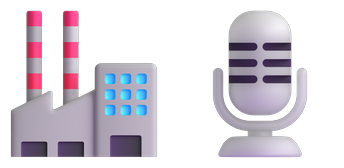

<p align="center">
  
</p>

<h1 align="center">Voicebox</h1>

<p align="center">
  <strong>Local-first AI voice studio — TTS, voice cloning, dictation, and MCP server for agent voice I/O.</strong><br>
  <sub>Part of <a href="../../">Data Science Skills Factory</a></sub>
</p>

---

Open-source, local-first AI voice studio — TTS, voice cloning, dictation, and MCP server for agent voice I/O.

## What It Does

- **Voice Cloning** — replicate any voice from 10-30s of audio, across 7 engines and 23 languages
- **Preset Voices** — 50+ built-in voices via Kokoro and Qwen CustomVoice
- **Dictation** — global push-to-talk hotkey, transcript lands in any text field
- **MCP Server** — built-in MCP endpoint so AI agents can speak in your cloned voices
- **Stories Editor** — multi-track timeline for podcasts, audiobooks, game dialogue
- **Effects** — pitch shift, reverb, delay, chorus via Spotify's Pedalboard
- **Fully Local** — no cloud, no API keys, no accounts

## When to Use This Skill

- Setting up Voicebox (install, MCP config, voice profiles)
- Generating speech from an AI agent via MCP
- Cloning voices or choosing preset voices
- Configuring dictation
- Troubleshooting TTS, GPU, or connectivity issues
- Building multi-voice stories or content pipelines

## Quick Start

```bash
# Add MCP server to Claude Code
claude mcp add voicebox --transport http http://127.0.0.1:17493/mcp --header "X-Voicebox-Client-Id: claude-code" --scope user

# Test it
# (from Claude Code) voicebox.list_profiles → voicebox.speak
```

## Links

- **Repo:** https://github.com/jamiepine/voicebox
- **Docs:** https://docs.voicebox.sh
- **Default endpoint:** http://127.0.0.1:17493
